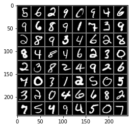
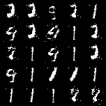

- [Generative Adversarial Networks (NIPS 2014)](https://arxiv.org/abs/1406.2661)

> - 2021/03/12 Happy-jihye
> - **Reference** : [eriklindernoren/PyTorch-GAN](https://github.com/eriklindernoren/PyTorch-GAN/blob/master/implementations/gan/gan.py)

---


**GAN - minimax two player game**
- Generative Adversarial Networks(GAN)은 adversarial process를 적용한 생성모델입니다. 주어진 입력 데이터와 유사한 데이터를 생성하는 것을 목표로 하며, Generator model과 Discriminative model이 경쟁하며 서로의 성능을 높여가는 재미있는 모델입니다. 
  - paper에서 나온 예시를 들면, 생성자 모델은 위조 지폐를 만드는 사람들과 유사하며, 판별자 모델은 위조지폐를 발견하는 경찰과 유사합니다. 생성자는 최대한 기존의 데이터(실제 지폐)와 유사한 지폐를 만들려고 노력하고, 판별자는 데이터 샘플이 모델 분포에서 왔는지(위조지폐), 실제 데이터 분포에서 왔는지(실제 지폐) 판별합니다.
  

**Discirminative model**

- 판별자는 이미지가 실제 data인지, 생성된 data인지를 판별한 후에 loss값을 계산합니다.


```python
import torch
import torch.nn as nn

import numpy as np

# for MNIST data
import torchvision
from torchvision import datasets
import torchvision.transforms as transforms
from torchvision.utils import save_image
from torch.autograd import Variable


import matplotlib.pyplot as plt
```

## **Loading MNIST Data**

- 이번 예제에서는 실제 MNIST training images를 활용하여 MNIST 숫자를 생성하는 GAN model을 만들 예정입니다.
- [How to Build a Streaming DataLoader with PyTorch](https://medium.com/speechmatics/how-to-build-a-streaming-dataloader-with-pytorch-a66dd891d9dd)


```python
# download the MINST data

batch_size = 64

transforms_train = transforms.Compose([
    transforms.Resize(28),
    transforms.ToTensor(), # data를 pytorch의 tensor형식으로 바꿉니다
    transforms.Normalize([0.5], [0.5]) # 픽셀값을 0 ~ 1에서 -1 ~ 1 로 바꿔줍니다.
])

train_dataset = datasets.MNIST(root="./dataset", train=True, download=True, transform=transforms_train)

# data를 batch size만큼만 가져오는 dataloader를 만듭니다.
dataloader = torch.utils.data.DataLoader(train_dataset, batch_size = batch_size, shuffle=True, num_workers=4)
```

{:.output_stream}

```
/usr/local/lib/python3.7/dist-packages/torch/utils/data/dataloader.py:477: UserWarning: This DataLoader will create 4 worker processes in total. Our suggested max number of worker in current system is 2, which is smaller than what this DataLoader is going to create. Please be aware that excessive worker creation might get DataLoader running slow or even freeze, lower the worker number to avoid potential slowness/freeze if necessary.
  cpuset_checked))

```

- 하나의 batch에 들어있는 mnist data를 출력해보았습니다.


```python
images, labels = next(iter(dataloader))
img = torchvision.utils.make_grid(images)

img = img.numpy().transpose(1,2,0)
std = [0.5,0.5,0.5]
mean = [0.5,0.5,0.5]
img = img*std+mean
print([labels[i] for i in range(64)])
plt.imshow(img)
```

{:.output_stream}

```
/usr/local/lib/python3.7/dist-packages/torch/utils/data/dataloader.py:477: UserWarning: This DataLoader will create 4 worker processes in total. Our suggested max number of worker in current system is 2, which is smaller than what this DataLoader is going to create. Please be aware that excessive worker creation might get DataLoader running slow or even freeze, lower the worker number to avoid potential slowness/freeze if necessary.
  cpuset_checked))

```

{:.output_stream}

```
[tensor(3), tensor(0), tensor(2), tensor(4), tensor(1), tensor(5), tensor(8), tensor(6), tensor(2), tensor(3), tensor(3), tensor(4), tensor(5), tensor(3), tensor(3), tensor(6), tensor(4), tensor(2), tensor(4), tensor(0), tensor(1), tensor(9), tensor(7), tensor(0), tensor(2), tensor(0), tensor(1), tensor(2), tensor(1), tensor(9), tensor(6), tensor(0), tensor(5), tensor(0), tensor(9), tensor(9), tensor(3), tensor(7), tensor(0), tensor(3), tensor(3), tensor(2), tensor(1), tensor(0), tensor(8), tensor(8), tensor(8), tensor(0), tensor(9), tensor(1), tensor(9), tensor(9), tensor(1), tensor(2), tensor(3), tensor(0), tensor(2), tensor(1), tensor(9), tensor(7), tensor(5), tensor(1), tensor(1), tensor(5)]

```


{:.output_data_text}

```
<matplotlib.image.AxesImage at 0x7f2021257c50>
```





```python
# image 

channels = 1
img_size = 28

img_shape = (channels, img_size, img_size)
```

##  Generator

- 생성자는 random vector *'z'*를 입력받아 가짜 이미지를 출력하는 함수입니다. 여기서 'z'는 정규분포(Normal Distribution)에서 무작위로 추출한 값으로, z vector가 존재하는 공간을 잠재공간(latent space)라고 부릅니다.
  - 이 튜토리얼에서는 잠재공간의 크기를 100으로 뒀으며, 잠재공간의 크기에는 제한이 없으나 나타내려고 하는 대상의 정보를 충분히 담을 수 있을 만큼 커야합니다.
- 즉, 생성자는 단순한 분포에서 사람 얼굴 이미지와 같은 복잡한 분포로 mapping하는 함수라고 볼 수 있습니다.


- 생성자에 충분히 많은 매개변수를 확보하기 위해 여러개의 layer를 쌓아서 생성자를 만들었습니다.
- [참고](https://dreamgonfly.github.io/blog/gan-explained/)


```python
# dimensionality of the latent space
# latent vector를 추출하기 위한 noise 분포의 dimension (정규분포를 따름)
latent_dim = 100

class Generator(nn.Module):
    def __init__(self):
        super(Generator, self).__init__()

        def block(input_dim, output_dim, normalize=True):
            layers = [nn.Linear(input_dim, output_dim)]
            if normalize:
                layers.append(nn.BatchNorm1d(output_dim, 0.8))
            layers.append(nn.LeakyReLU(0.2, inplace=True))
            return layers

        # generater의 model은 여러개의 block을 쌓아서 만들어짐
        self.model = nn.Sequential(
            *block(latent_dim, 128, normalize=False),
            *block(128, 256),
            *block(256, 512),
            *block(512, 1024),
            nn.Linear(1024, int(np.prod(img_shape))),
            nn.Tanh() 
        )

    def forward(self, z): 
        # z : input noise vector 
        img = self.model(z)
        img = img.view(img.size(0), *img_shape)
        return img
```

## Discriminator


```python
class Discriminator(nn.Module):
    def __init__(self):
        super(Discriminator, self).__init__()

        self.model = nn.Sequential(
            nn.Linear(int(np.prod(img_shape)), 512),
            nn.LeakyReLU(0.2, inplace=True),
            nn.Linear(512, 256),
            nn.LeakyReLU(0.2, inplace=True),
            nn.Linear(256, 1),
            nn.Sigmoid(),
        )

    # 이미지에 대한 판별 결과를 반환
    def forward(self, img):
        img_flat = img.view(img.size(0), -1)
        validity = self.model(img_flat)

        return validity
```

## Loss Function & Optimizer

- 손실 함수로는 Binary Cross Entropy를, 최적화 함수로는 Adam을 사용합니다.


```python
''' Hyper parameter '''
# learning rate
lr = 0.0002

# decay of first order momentum of gradient
b1 = 0.5
b2 = 0.999


# Initialize generator and discriminator
generator = Generator()
discriminator = Discriminator()

# Loss function
adversarial_loss = nn.BCELoss()

# Adam Optimizer
optimizer_G = torch.optim.Adam(generator.parameters(), lr=lr, betas=(b1, b2))
optimizer_D = torch.optim.Adam(discriminator.parameters(), lr=lr, betas=(b1, b2))
```


```python
# GPU
cuda = True if torch.cuda.is_available() else False

if cuda : 
  generator.cuda()
  discriminator.cuda()
  adversarial_loss.cuda()
```

# Training

- GAN model에서는 근사적인 추론이나 Markov chains을 사용하지 않고, back-propagation만을 이용하여 gradient를 업데이트합니다.


```python
import time

# number of epochs of training
n_epochs = 200 

# interval between image samples
sample_interval = 2000 

start_time = time.time()

Tensor = torch.cuda.FloatTensor if cuda else torch.FloatTensor


for epoch in range(n_epochs):
    for i, (imgs, _) in enumerate(dataloader):

        # Adversarial ground truths
        ## 실제 이미지는 1로, 가짜 이미지는 0으로 label됩니다. 
        real = Variable(Tensor(imgs.size(0), 1).fill_(1.0), requires_grad=False)
        fake = Variable(Tensor(imgs.size(0), 1).fill_(0.0), requires_grad=False)

        # Configure input
        real_imgs = Variable(imgs.type(Tensor))

        # -----------------
        #  Train Generator
        # -----------------

        optimizer_G.zero_grad()

        # Sample noise as generator input
        z = Variable(Tensor(np.random.normal(0, 1, (imgs.shape[0], latent_dim))))

        # Generate a batch of images
        ## random sampling한 값인 z를 생성자에 넣어 이미지를 생성합니다.
        generated_imgs = generator(z)

        # Loss measures generator's ability to fool the discriminator
        ## 생성된 이미지를 discriminator가 판별하게 한 후, loss값을 계산합니다.
        g_loss = adversarial_loss(discriminator(generated_imgs), real)

        # 생성자(generator) 업데이트
        g_loss.backward()
        optimizer_G.step()

        # ---------------------
        #  Train Discriminator
        # ---------------------

        optimizer_D.zero_grad()

        # Measure discriminator's ability to classify real from generated samples
        ## 실제 이미지는 real(1)로, 가짜 이미지는 fake(0)으로 판별하도록 계산합니다.
        real_loss = adversarial_loss(discriminator(real_imgs), real)
        fake_loss = adversarial_loss(discriminator(generated_imgs.detach()), fake)
        d_loss = (real_loss + fake_loss) / 2

        # 판별자(discriminator) 업데이트
        d_loss.backward()
        optimizer_D.step()

        done = epoch * len(dataloader) + i
        if done % sample_interval == 0:
            # 생성된 이미지 중에서 25개만 선택하여 5 X 5 격자 이미지에 출력
            save_image(generated_imgs.data[:25], f"{done}.png", nrow=5, normalize=True)

    # 하나의 epoch이 끝날 때마다 로그(log) 출력
    print(f"[Epoch {epoch}/{n_epochs}] [D loss: {d_loss.item():.6f}] [G loss: {g_loss.item():.6f}] [Elapsed time: {time.time() - start_time:.2f}s]")
```

{:.output_stream}

```
/usr/local/lib/python3.7/dist-packages/torch/utils/data/dataloader.py:477: UserWarning: This DataLoader will create 4 worker processes in total. Our suggested max number of worker in current system is 2, which is smaller than what this DataLoader is going to create. Please be aware that excessive worker creation might get DataLoader running slow or even freeze, lower the worker number to avoid potential slowness/freeze if necessary.
  cpuset_checked))

```

{:.output_stream}

```
[Epoch 0/200] [D loss: 0.471759] [G loss: 2.498926] [Elapsed time: 14.76s]
[Epoch 1/200] [D loss: 0.258078] [G loss: 1.360531] [Elapsed time: 29.48s]
[Epoch 2/200] [D loss: 0.506363] [G loss: 0.565381] [Elapsed time: 44.00s]
[Epoch 3/200] [D loss: 0.160770] [G loss: 2.556153] [Elapsed time: 58.55s]
[Epoch 4/200] [D loss: 0.264552] [G loss: 0.989236] [Elapsed time: 73.20s]
[Epoch 5/200] [D loss: 0.133583] [G loss: 2.088663] [Elapsed time: 87.77s]
[Epoch 6/200] [D loss: 0.186072] [G loss: 1.772844] [Elapsed time: 102.10s]
[Epoch 7/200] [D loss: 0.153044] [G loss: 2.998716] [Elapsed time: 116.41s]
[Epoch 8/200] [D loss: 0.232274] [G loss: 2.617228] [Elapsed time: 130.92s]
[Epoch 9/200] [D loss: 0.122365] [G loss: 3.231926] [Elapsed time: 145.17s]
[Epoch 10/200] [D loss: 0.302830] [G loss: 5.149670] [Elapsed time: 159.31s]
[Epoch 11/200] [D loss: 0.175924] [G loss: 1.710651] [Elapsed time: 173.71s]
[Epoch 12/200] [D loss: 1.077994] [G loss: 10.032361] [Elapsed time: 187.91s]
[Epoch 13/200] [D loss: 0.379605] [G loss: 6.249554] [Elapsed time: 202.06s]
[Epoch 14/200] [D loss: 0.100095] [G loss: 2.171618] [Elapsed time: 215.95s]
[Epoch 15/200] [D loss: 0.131309] [G loss: 2.922925] [Elapsed time: 229.88s]
[Epoch 16/200] [D loss: 0.156259] [G loss: 1.939096] [Elapsed time: 243.95s]
[Epoch 17/200] [D loss: 0.302560] [G loss: 1.398404] [Elapsed time: 257.98s]
[Epoch 18/200] [D loss: 0.063372] [G loss: 3.705532] [Elapsed time: 272.06s]
[Epoch 19/200] [D loss: 0.190959] [G loss: 2.096316] [Elapsed time: 286.03s]
[Epoch 20/200] [D loss: 0.229849] [G loss: 1.572154] [Elapsed time: 300.00s]
[Epoch 21/200] [D loss: 0.152074] [G loss: 1.752552] [Elapsed time: 313.74s]
[Epoch 22/200] [D loss: 0.283679] [G loss: 2.254345] [Elapsed time: 327.80s]
[Epoch 23/200] [D loss: 0.188353] [G loss: 3.146157] [Elapsed time: 341.79s]
[Epoch 24/200] [D loss: 1.029916] [G loss: 6.659109] [Elapsed time: 355.67s]
[Epoch 25/200] [D loss: 0.161970] [G loss: 2.446658] [Elapsed time: 369.52s]
[Epoch 26/200] [D loss: 0.156872] [G loss: 1.990241] [Elapsed time: 383.30s]
[Epoch 27/200] [D loss: 0.371905] [G loss: 3.593179] [Elapsed time: 397.24s]
[Epoch 28/200] [D loss: 0.111382] [G loss: 4.116124] [Elapsed time: 411.14s]
[Epoch 29/200] [D loss: 0.470980] [G loss: 0.708848] [Elapsed time: 425.05s]
[Epoch 30/200] [D loss: 0.030144] [G loss: 4.262062] [Elapsed time: 438.89s]
[Epoch 31/200] [D loss: 0.367642] [G loss: 1.317938] [Elapsed time: 452.90s]
[Epoch 32/200] [D loss: 0.912699] [G loss: 9.361526] [Elapsed time: 466.81s]
[Epoch 33/200] [D loss: 0.036981] [G loss: 3.532357] [Elapsed time: 480.66s]
[Epoch 34/200] [D loss: 0.155981] [G loss: 3.499463] [Elapsed time: 494.95s]
[Epoch 35/200] [D loss: 0.085159] [G loss: 6.146234] [Elapsed time: 508.91s]
[Epoch 36/200] [D loss: 0.089109] [G loss: 2.662564] [Elapsed time: 522.84s]
[Epoch 37/200] [D loss: 0.095351] [G loss: 2.941463] [Elapsed time: 536.67s]
[Epoch 38/200] [D loss: 0.089700] [G loss: 2.609955] [Elapsed time: 550.68s]
[Epoch 39/200] [D loss: 0.152116] [G loss: 2.306224] [Elapsed time: 564.74s]
[Epoch 40/200] [D loss: 0.055723] [G loss: 4.179073] [Elapsed time: 578.81s]
[Epoch 41/200] [D loss: 0.322049] [G loss: 1.538030] [Elapsed time: 592.95s]
[Epoch 42/200] [D loss: 0.430351] [G loss: 1.561949] [Elapsed time: 607.01s]
[Epoch 43/200] [D loss: 0.058869] [G loss: 3.600948] [Elapsed time: 621.00s]
[Epoch 44/200] [D loss: 0.272983] [G loss: 3.128258] [Elapsed time: 635.21s]
[Epoch 45/200] [D loss: 0.394016] [G loss: 4.879756] [Elapsed time: 649.17s]
[Epoch 46/200] [D loss: 0.119651] [G loss: 2.753067] [Elapsed time: 663.28s]
[Epoch 47/200] [D loss: 0.153702] [G loss: 2.204500] [Elapsed time: 677.26s]
[Epoch 48/200] [D loss: 0.188769] [G loss: 1.737892] [Elapsed time: 691.29s]
[Epoch 49/200] [D loss: 0.187364] [G loss: 1.673546] [Elapsed time: 705.30s]
[Epoch 50/200] [D loss: 0.089061] [G loss: 2.960242] [Elapsed time: 719.33s]
[Epoch 51/200] [D loss: 0.083760] [G loss: 4.156516] [Elapsed time: 733.46s]
[Epoch 52/200] [D loss: 0.153086] [G loss: 2.854456] [Elapsed time: 747.53s]
[Epoch 53/200] [D loss: 0.078112] [G loss: 3.230090] [Elapsed time: 761.53s]
[Epoch 54/200] [D loss: 0.117524] [G loss: 2.684306] [Elapsed time: 775.34s]
[Epoch 55/200] [D loss: 0.062793] [G loss: 2.696014] [Elapsed time: 789.32s]
[Epoch 56/200] [D loss: 0.129348] [G loss: 2.492670] [Elapsed time: 803.52s]
[Epoch 57/200] [D loss: 0.516609] [G loss: 0.718028] [Elapsed time: 817.44s]
[Epoch 58/200] [D loss: 0.094234] [G loss: 3.332732] [Elapsed time: 831.34s]
[Epoch 59/200] [D loss: 0.117123] [G loss: 3.405851] [Elapsed time: 845.21s]
[Epoch 60/200] [D loss: 0.178143] [G loss: 2.371056] [Elapsed time: 859.39s]
[Epoch 61/200] [D loss: 0.142254] [G loss: 3.613462] [Elapsed time: 873.38s]
[Epoch 62/200] [D loss: 0.167155] [G loss: 2.322675] [Elapsed time: 887.31s]
[Epoch 63/200] [D loss: 0.242843] [G loss: 4.212345] [Elapsed time: 901.34s]
[Epoch 64/200] [D loss: 0.134740] [G loss: 3.074319] [Elapsed time: 915.22s]
[Epoch 65/200] [D loss: 0.241978] [G loss: 1.868056] [Elapsed time: 929.25s]
[Epoch 66/200] [D loss: 0.137924] [G loss: 2.322740] [Elapsed time: 943.08s]
[Epoch 67/200] [D loss: 0.132789] [G loss: 4.164216] [Elapsed time: 957.18s]
[Epoch 68/200] [D loss: 0.217806] [G loss: 3.590649] [Elapsed time: 971.20s]
[Epoch 69/200] [D loss: 0.185790] [G loss: 1.954789] [Elapsed time: 985.16s]
[Epoch 70/200] [D loss: 0.178165] [G loss: 1.816711] [Elapsed time: 998.98s]
[Epoch 71/200] [D loss: 0.105815] [G loss: 2.812864] [Elapsed time: 1012.62s]
[Epoch 72/200] [D loss: 0.142102] [G loss: 2.455540] [Elapsed time: 1026.57s]
[Epoch 73/200] [D loss: 0.140517] [G loss: 3.028923] [Elapsed time: 1040.37s]
[Epoch 74/200] [D loss: 0.213927] [G loss: 2.788099] [Elapsed time: 1054.32s]
[Epoch 75/200] [D loss: 0.109705] [G loss: 2.153857] [Elapsed time: 1068.19s]
[Epoch 76/200] [D loss: 0.111131] [G loss: 4.758657] [Elapsed time: 1082.06s]
[Epoch 77/200] [D loss: 0.173954] [G loss: 2.787045] [Elapsed time: 1096.04s]
[Epoch 78/200] [D loss: 0.249303] [G loss: 2.955476] [Elapsed time: 1110.49s]
[Epoch 79/200] [D loss: 0.154048] [G loss: 2.573095] [Elapsed time: 1124.71s]
[Epoch 80/200] [D loss: 0.252817] [G loss: 2.683591] [Elapsed time: 1139.35s]
[Epoch 81/200] [D loss: 0.141842] [G loss: 2.890982] [Elapsed time: 1153.14s]
[Epoch 82/200] [D loss: 0.308761] [G loss: 3.286925] [Elapsed time: 1167.11s]
[Epoch 83/200] [D loss: 0.328008] [G loss: 5.489707] [Elapsed time: 1180.88s]
[Epoch 84/200] [D loss: 0.175508] [G loss: 3.629070] [Elapsed time: 1194.82s]
[Epoch 85/200] [D loss: 0.143888] [G loss: 2.039110] [Elapsed time: 1208.67s]
[Epoch 86/200] [D loss: 0.320809] [G loss: 1.220029] [Elapsed time: 1223.18s]
[Epoch 87/200] [D loss: 0.240321] [G loss: 4.239978] [Elapsed time: 1237.72s]
[Epoch 88/200] [D loss: 0.082273] [G loss: 3.039834] [Elapsed time: 1252.15s]
[Epoch 89/200] [D loss: 0.078215] [G loss: 2.998454] [Elapsed time: 1266.30s]
[Epoch 90/200] [D loss: 0.341432] [G loss: 4.797333] [Elapsed time: 1280.46s]
[Epoch 91/200] [D loss: 0.192964] [G loss: 1.561713] [Elapsed time: 1294.60s]
[Epoch 92/200] [D loss: 0.140088] [G loss: 1.754924] [Elapsed time: 1308.51s]
[Epoch 93/200] [D loss: 0.230784] [G loss: 1.564927] [Elapsed time: 1322.37s]
[Epoch 94/200] [D loss: 0.249548] [G loss: 2.059541] [Elapsed time: 1336.22s]
[Epoch 95/200] [D loss: 0.153174] [G loss: 6.851552] [Elapsed time: 1349.90s]
[Epoch 96/200] [D loss: 0.167460] [G loss: 3.081244] [Elapsed time: 1363.66s]
[Epoch 97/200] [D loss: 0.303089] [G loss: 5.445709] [Elapsed time: 1377.38s]
[Epoch 98/200] [D loss: 0.227196] [G loss: 3.169494] [Elapsed time: 1391.29s]
[Epoch 99/200] [D loss: 0.086363] [G loss: 3.614922] [Elapsed time: 1405.06s]
[Epoch 100/200] [D loss: 0.239604] [G loss: 4.705026] [Elapsed time: 1419.08s]
[Epoch 101/200] [D loss: 0.254776] [G loss: 3.400284] [Elapsed time: 1433.00s]
[Epoch 102/200] [D loss: 0.370397] [G loss: 2.207709] [Elapsed time: 1446.98s]
[Epoch 103/200] [D loss: 0.139329] [G loss: 2.707013] [Elapsed time: 1461.05s]
[Epoch 104/200] [D loss: 0.238719] [G loss: 3.357561] [Elapsed time: 1475.03s]
[Epoch 105/200] [D loss: 0.143495] [G loss: 2.409102] [Elapsed time: 1488.71s]
[Epoch 106/200] [D loss: 0.078880] [G loss: 3.850837] [Elapsed time: 1502.61s]
[Epoch 107/200] [D loss: 0.236380] [G loss: 1.828072] [Elapsed time: 1516.56s]
[Epoch 108/200] [D loss: 0.189249] [G loss: 2.452341] [Elapsed time: 1530.76s]
[Epoch 109/200] [D loss: 0.129384] [G loss: 2.982568] [Elapsed time: 1544.80s]
[Epoch 110/200] [D loss: 0.165743] [G loss: 3.545001] [Elapsed time: 1559.10s]
[Epoch 111/200] [D loss: 0.107244] [G loss: 3.128242] [Elapsed time: 1573.50s]
[Epoch 112/200] [D loss: 0.048370] [G loss: 2.911887] [Elapsed time: 1587.84s]
[Epoch 113/200] [D loss: 0.127220] [G loss: 3.085252] [Elapsed time: 1602.11s]
[Epoch 114/200] [D loss: 0.163831] [G loss: 3.713338] [Elapsed time: 1616.39s]
[Epoch 115/200] [D loss: 0.131652] [G loss: 2.758687] [Elapsed time: 1630.76s]
[Epoch 116/200] [D loss: 0.190050] [G loss: 3.829230] [Elapsed time: 1644.86s]
[Epoch 117/200] [D loss: 0.329439] [G loss: 1.722775] [Elapsed time: 1659.12s]
[Epoch 118/200] [D loss: 0.336820] [G loss: 3.093416] [Elapsed time: 1673.00s]
[Epoch 119/200] [D loss: 0.249919] [G loss: 5.030234] [Elapsed time: 1687.24s]
[Epoch 120/200] [D loss: 0.150939] [G loss: 2.602765] [Elapsed time: 1701.60s]
[Epoch 121/200] [D loss: 0.340541] [G loss: 1.192826] [Elapsed time: 1716.03s]
[Epoch 122/200] [D loss: 0.204778] [G loss: 2.319441] [Elapsed time: 1730.32s]
[Epoch 123/200] [D loss: 0.265503] [G loss: 2.502042] [Elapsed time: 1744.79s]
[Epoch 124/200] [D loss: 0.090079] [G loss: 4.162290] [Elapsed time: 1759.39s]
[Epoch 125/200] [D loss: 0.128552] [G loss: 3.818121] [Elapsed time: 1773.97s]
[Epoch 126/200] [D loss: 0.152484] [G loss: 2.551260] [Elapsed time: 1788.54s]
[Epoch 127/200] [D loss: 0.102876] [G loss: 2.895010] [Elapsed time: 1802.87s]
[Epoch 128/200] [D loss: 0.246319] [G loss: 2.565826] [Elapsed time: 1817.30s]
[Epoch 129/200] [D loss: 0.253140] [G loss: 1.928526] [Elapsed time: 1831.78s]
[Epoch 130/200] [D loss: 0.072518] [G loss: 4.683798] [Elapsed time: 1846.14s]
[Epoch 131/200] [D loss: 0.062900] [G loss: 5.386453] [Elapsed time: 1860.76s]
[Epoch 132/200] [D loss: 0.227559] [G loss: 2.679538] [Elapsed time: 1875.27s]
[Epoch 133/200] [D loss: 0.056237] [G loss: 3.179911] [Elapsed time: 1889.79s]
[Epoch 134/200] [D loss: 0.063767] [G loss: 3.168057] [Elapsed time: 1904.27s]
[Epoch 135/200] [D loss: 0.035797] [G loss: 4.308327] [Elapsed time: 1918.74s]
[Epoch 136/200] [D loss: 0.278662] [G loss: 3.192648] [Elapsed time: 1933.42s]
[Epoch 137/200] [D loss: 0.174124] [G loss: 2.366418] [Elapsed time: 1947.92s]
[Epoch 138/200] [D loss: 0.091623] [G loss: 2.577150] [Elapsed time: 1962.25s]
[Epoch 139/200] [D loss: 0.174499] [G loss: 1.990156] [Elapsed time: 1976.78s]
[Epoch 140/200] [D loss: 0.130902] [G loss: 2.356941] [Elapsed time: 1991.34s]
[Epoch 141/200] [D loss: 0.146029] [G loss: 2.808218] [Elapsed time: 2005.91s]
[Epoch 142/200] [D loss: 0.130911] [G loss: 3.724998] [Elapsed time: 2020.49s]
[Epoch 143/200] [D loss: 0.209646] [G loss: 4.367015] [Elapsed time: 2034.87s]
[Epoch 144/200] [D loss: 0.107683] [G loss: 3.675255] [Elapsed time: 2049.29s]
[Epoch 145/200] [D loss: 0.203981] [G loss: 2.901490] [Elapsed time: 2063.77s]
[Epoch 146/200] [D loss: 0.299603] [G loss: 4.134932] [Elapsed time: 2078.36s]
[Epoch 147/200] [D loss: 0.249533] [G loss: 3.840227] [Elapsed time: 2092.74s]
[Epoch 148/200] [D loss: 0.086836] [G loss: 2.298738] [Elapsed time: 2107.29s]
[Epoch 149/200] [D loss: 0.115477] [G loss: 2.845057] [Elapsed time: 2121.80s]
[Epoch 150/200] [D loss: 0.341541] [G loss: 2.399746] [Elapsed time: 2136.12s]
[Epoch 151/200] [D loss: 0.249897] [G loss: 2.482690] [Elapsed time: 2150.77s]
[Epoch 152/200] [D loss: 0.176051] [G loss: 5.213724] [Elapsed time: 2165.05s]
[Epoch 153/200] [D loss: 0.244363] [G loss: 2.824422] [Elapsed time: 2179.60s]
[Epoch 154/200] [D loss: 0.119649] [G loss: 3.096649] [Elapsed time: 2194.13s]
[Epoch 155/200] [D loss: 0.191622] [G loss: 2.617204] [Elapsed time: 2208.52s]
[Epoch 156/200] [D loss: 0.544389] [G loss: 1.386867] [Elapsed time: 2222.87s]
[Epoch 157/200] [D loss: 0.320870] [G loss: 1.850879] [Elapsed time: 2237.28s]
[Epoch 158/200] [D loss: 0.385131] [G loss: 4.852019] [Elapsed time: 2251.94s]
[Epoch 159/200] [D loss: 0.178168] [G loss: 3.506092] [Elapsed time: 2266.32s]
[Epoch 160/200] [D loss: 0.120640] [G loss: 2.496179] [Elapsed time: 2280.87s]
[Epoch 161/200] [D loss: 0.235010] [G loss: 5.605097] [Elapsed time: 2295.13s]
[Epoch 162/200] [D loss: 0.151648] [G loss: 2.366621] [Elapsed time: 2309.28s]
[Epoch 163/200] [D loss: 0.083595] [G loss: 3.719189] [Elapsed time: 2323.48s]
[Epoch 164/200] [D loss: 0.103325] [G loss: 3.124715] [Elapsed time: 2337.74s]
[Epoch 165/200] [D loss: 0.159524] [G loss: 2.851463] [Elapsed time: 2352.21s]
[Epoch 166/200] [D loss: 0.177051] [G loss: 2.758801] [Elapsed time: 2366.28s]
[Epoch 167/200] [D loss: 0.104176] [G loss: 3.087439] [Elapsed time: 2380.59s]
[Epoch 168/200] [D loss: 0.153967] [G loss: 2.870278] [Elapsed time: 2394.70s]
[Epoch 169/200] [D loss: 0.212191] [G loss: 2.715330] [Elapsed time: 2408.72s]
[Epoch 170/200] [D loss: 0.422314] [G loss: 4.900161] [Elapsed time: 2423.04s]
[Epoch 171/200] [D loss: 0.251617] [G loss: 3.167797] [Elapsed time: 2437.43s]
[Epoch 172/200] [D loss: 0.133705] [G loss: 2.556691] [Elapsed time: 2451.61s]
[Epoch 173/200] [D loss: 0.201554] [G loss: 2.855657] [Elapsed time: 2465.46s]
[Epoch 174/200] [D loss: 0.241487] [G loss: 3.035454] [Elapsed time: 2479.75s]
[Epoch 175/200] [D loss: 0.113004] [G loss: 3.447474] [Elapsed time: 2493.79s]
[Epoch 176/200] [D loss: 0.113280] [G loss: 2.308869] [Elapsed time: 2508.01s]
[Epoch 177/200] [D loss: 0.098086] [G loss: 3.240656] [Elapsed time: 2522.03s]
[Epoch 178/200] [D loss: 0.196794] [G loss: 2.010662] [Elapsed time: 2536.05s]
[Epoch 179/200] [D loss: 0.177125] [G loss: 4.325840] [Elapsed time: 2550.18s]
[Epoch 180/200] [D loss: 0.111857] [G loss: 2.143391] [Elapsed time: 2564.18s]
[Epoch 181/200] [D loss: 0.243066] [G loss: 2.029562] [Elapsed time: 2578.18s]
[Epoch 182/200] [D loss: 0.105496] [G loss: 3.798521] [Elapsed time: 2592.19s]
[Epoch 183/200] [D loss: 0.278503] [G loss: 2.005502] [Elapsed time: 2606.21s]
[Epoch 184/200] [D loss: 0.203799] [G loss: 3.781436] [Elapsed time: 2620.08s]
[Epoch 185/200] [D loss: 0.143679] [G loss: 2.971976] [Elapsed time: 2634.03s]
[Epoch 186/200] [D loss: 0.169341] [G loss: 3.042297] [Elapsed time: 2648.07s]
[Epoch 187/200] [D loss: 0.181312] [G loss: 2.750633] [Elapsed time: 2662.16s]
[Epoch 188/200] [D loss: 0.253715] [G loss: 4.003806] [Elapsed time: 2676.54s]
[Epoch 189/200] [D loss: 0.112726] [G loss: 3.988058] [Elapsed time: 2690.70s]
[Epoch 190/200] [D loss: 0.159130] [G loss: 3.213053] [Elapsed time: 2704.89s]
[Epoch 191/200] [D loss: 0.523089] [G loss: 5.612353] [Elapsed time: 2719.04s]
[Epoch 192/200] [D loss: 0.144144] [G loss: 2.551974] [Elapsed time: 2733.16s]
[Epoch 193/200] [D loss: 0.067084] [G loss: 2.935313] [Elapsed time: 2747.64s]
[Epoch 194/200] [D loss: 0.293046] [G loss: 3.061961] [Elapsed time: 2762.06s]
[Epoch 195/200] [D loss: 0.104381] [G loss: 2.669097] [Elapsed time: 2776.57s]
[Epoch 196/200] [D loss: 0.312934] [G loss: 4.082441] [Elapsed time: 2790.80s]
[Epoch 197/200] [D loss: 0.239830] [G loss: 3.247385] [Elapsed time: 2805.14s]
[Epoch 198/200] [D loss: 0.128507] [G loss: 3.124521] [Elapsed time: 2819.49s]
[Epoch 199/200] [D loss: 0.111848] [G loss: 3.594412] [Elapsed time: 2834.25s]

```

## Image


```python
from IPython.display import Image


Image('104000.png')
```





