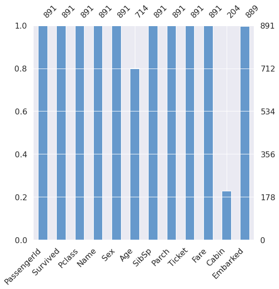

# [Kaggle Tutorial] Data Analysis for Titanic 

Kaggle의 가장 기본적인 튜토리얼입니다. kaggle의 초보자분들은 이 튜토리얼을 통해 시작하시는 것을 추천드립니다.

- ⭐ **Goal** : 타이타닉에서 살아남은 승객의 수를 예측하는 모델 만들기

---

## 1. Import Library

데이터 분석에 필요한 라이브러리를 불러옵니다.


```python
import os

# Data Analysis
import numpy as np
import pandas as pd
import matplotlib.pyplot as plt

# Data Visualization
import seaborn as sns
import missingno as msno

import warnings

# seaborn의 font scale을 사용하여 graph의 font size를 지정합니다.
plt.style.use('seaborn')
sns.set(font_scale=2.5)

# ignore warnings
warnings.filterwarnings('ignore')

# 브라우저의 내부에 plot을 그릴 수 있도록 설정합니다.
%matplotlib inline
```

Machine Learning 도구인 **Scikit-Learn**를 불러옵니다.

- `LogisticRegression` : 데이터가 특정 카테고리에 속해있는지의 여부를 0에서 1의 확률로 예측하는 회귀 알고리즘입니다.
- `SVM(Support Vector Machine)` : 데이터가 특정 카테고리에 속해있는지 여부를 판단해주는 지도학습 모델로, classification이나 logistic regression에 자주 사용됩니다.
- `Random Forest` : 다수의 decision tree(결정트리)를 학습시키는 ensemble machine learning모델입니다.
- `k-nearest neighbors(KNN)` : 어떤 데이터가 주어졌을때, 주변의 데이터(이웃)들과 한 범주로 묶어주는 모델입니다.


```python
from sklearn.linear_model import LogisticRegression
from sklearn.svm import SVC, LinearSVC
from sklearn.ensemble import RandomForestClassifier
from sklearn.neighbors import KNeighborsClassifier

from sklearn import metrics
from sklearn.model_selection import train_test_split
```

## 2. Data Analysis

titanic 대회에서 제공하는 csv 형식의 train, test data를 불러옵니다.

`pandas` library를 통해 불러온 데이터들을 살펴보겠습니다.

### 2.1 Read & Check Data


```python
# pandas를 이용하여 데이터를 읽어옵니다.
train = pd.read_csv('../input/titanic/train.csv')
test = pd.read_csv('../input/titanic/test.csv')
```


```python
# head() 함수는 상위 5개의 data를 불러옵니다. 
# head(10)과 같이 원하는 data의 개수를 input으로 준다면, 더 많은 데이터를 불러올 수 있습니다.

train.head(10)
```


<div markdown="0">
<div>
<style scoped>
    .dataframe tbody tr th:only-of-type {
        vertical-align: middle;
    }

    .dataframe tbody tr th {
        vertical-align: top;
    }

    .dataframe thead th {
        text-align: right;
    }
</style>
<table border="1" class="dataframe">
  <thead>
    <tr style="text-align: right;">
      <th></th>
      <th>PassengerId</th>
      <th>Survived</th>
      <th>Pclass</th>
      <th>Name</th>
      <th>Sex</th>
      <th>Age</th>
      <th>SibSp</th>
      <th>Parch</th>
      <th>Ticket</th>
      <th>Fare</th>
      <th>Cabin</th>
      <th>Embarked</th>
    </tr>
  </thead>
  <tbody>
    <tr>
      <th>0</th>
      <td>1</td>
      <td>0</td>
      <td>3</td>
      <td>Braund, Mr. Owen Harris</td>
      <td>male</td>
      <td>22.0</td>
      <td>1</td>
      <td>0</td>
      <td>A/5 21171</td>
      <td>7.2500</td>
      <td>NaN</td>
      <td>S</td>
    </tr>
    <tr>
      <th>1</th>
      <td>2</td>
      <td>1</td>
      <td>1</td>
      <td>Cumings, Mrs. John Bradley (Florence Briggs Th...</td>
      <td>female</td>
      <td>38.0</td>
      <td>1</td>
      <td>0</td>
      <td>PC 17599</td>
      <td>71.2833</td>
      <td>C85</td>
      <td>C</td>
    </tr>
    <tr>
      <th>2</th>
      <td>3</td>
      <td>1</td>
      <td>3</td>
      <td>Heikkinen, Miss. Laina</td>
      <td>female</td>
      <td>26.0</td>
      <td>0</td>
      <td>0</td>
      <td>STON/O2. 3101282</td>
      <td>7.9250</td>
      <td>NaN</td>
      <td>S</td>
    </tr>
    <tr>
      <th>3</th>
      <td>4</td>
      <td>1</td>
      <td>1</td>
      <td>Futrelle, Mrs. Jacques Heath (Lily May Peel)</td>
      <td>female</td>
      <td>35.0</td>
      <td>1</td>
      <td>0</td>
      <td>113803</td>
      <td>53.1000</td>
      <td>C123</td>
      <td>S</td>
    </tr>
    <tr>
      <th>4</th>
      <td>5</td>
      <td>0</td>
      <td>3</td>
      <td>Allen, Mr. William Henry</td>
      <td>male</td>
      <td>35.0</td>
      <td>0</td>
      <td>0</td>
      <td>373450</td>
      <td>8.0500</td>
      <td>NaN</td>
      <td>S</td>
    </tr>
    <tr>
      <th>5</th>
      <td>6</td>
      <td>0</td>
      <td>3</td>
      <td>Moran, Mr. James</td>
      <td>male</td>
      <td>NaN</td>
      <td>0</td>
      <td>0</td>
      <td>330877</td>
      <td>8.4583</td>
      <td>NaN</td>
      <td>Q</td>
    </tr>
    <tr>
      <th>6</th>
      <td>7</td>
      <td>0</td>
      <td>1</td>
      <td>McCarthy, Mr. Timothy J</td>
      <td>male</td>
      <td>54.0</td>
      <td>0</td>
      <td>0</td>
      <td>17463</td>
      <td>51.8625</td>
      <td>E46</td>
      <td>S</td>
    </tr>
    <tr>
      <th>7</th>
      <td>8</td>
      <td>0</td>
      <td>3</td>
      <td>Palsson, Master. Gosta Leonard</td>
      <td>male</td>
      <td>2.0</td>
      <td>3</td>
      <td>1</td>
      <td>349909</td>
      <td>21.0750</td>
      <td>NaN</td>
      <td>S</td>
    </tr>
    <tr>
      <th>8</th>
      <td>9</td>
      <td>1</td>
      <td>3</td>
      <td>Johnson, Mrs. Oscar W (Elisabeth Vilhelmina Berg)</td>
      <td>female</td>
      <td>27.0</td>
      <td>0</td>
      <td>2</td>
      <td>347742</td>
      <td>11.1333</td>
      <td>NaN</td>
      <td>S</td>
    </tr>
    <tr>
      <th>9</th>
      <td>10</td>
      <td>1</td>
      <td>2</td>
      <td>Nasser, Mrs. Nicholas (Adele Achem)</td>
      <td>female</td>
      <td>14.0</td>
      <td>1</td>
      <td>0</td>
      <td>237736</td>
      <td>30.0708</td>
      <td>NaN</td>
      <td>C</td>
    </tr>
  </tbody>
</table>
</div>
</div>


```python
# columns 함수를 사용하면, train dataset의 열에 해당하는 정보들을 불러올 수 있습니다.

train.columns
```


{:.output_data_text}

```
Index(['PassengerId', 'Survived', 'Pclass', 'Name', 'Sex', 'Age', 'SibSp',
       'Parch', 'Ticket', 'Fare', 'Cabin', 'Embarked'],
      dtype='object')
```


```python
# data의 (columns, rows)를 불러옵니다.
print("train : ", train.shape, ", test : ", test.shape)
```

{:.output_stream}

```
train :  (891, 12) , test :  (418, 11)

```


```python
# describe() 함수는 data의 columns 별 통계량을 가져옵니다.

train.describe()
```


<div markdown="0">
<div>
<style scoped>
    .dataframe tbody tr th:only-of-type {
        vertical-align: middle;
    }

    .dataframe tbody tr th {
        vertical-align: top;
    }

    .dataframe thead th {
        text-align: right;
    }
</style>
<table border="1" class="dataframe">
  <thead>
    <tr style="text-align: right;">
      <th></th>
      <th>PassengerId</th>
      <th>Survived</th>
      <th>Pclass</th>
      <th>Age</th>
      <th>SibSp</th>
      <th>Parch</th>
      <th>Fare</th>
    </tr>
  </thead>
  <tbody>
    <tr>
      <th>count</th>
      <td>891.000000</td>
      <td>891.000000</td>
      <td>891.000000</td>
      <td>714.000000</td>
      <td>891.000000</td>
      <td>891.000000</td>
      <td>891.000000</td>
    </tr>
    <tr>
      <th>mean</th>
      <td>446.000000</td>
      <td>0.383838</td>
      <td>2.308642</td>
      <td>29.699118</td>
      <td>0.523008</td>
      <td>0.381594</td>
      <td>32.204208</td>
    </tr>
    <tr>
      <th>std</th>
      <td>257.353842</td>
      <td>0.486592</td>
      <td>0.836071</td>
      <td>14.526497</td>
      <td>1.102743</td>
      <td>0.806057</td>
      <td>49.693429</td>
    </tr>
    <tr>
      <th>min</th>
      <td>1.000000</td>
      <td>0.000000</td>
      <td>1.000000</td>
      <td>0.420000</td>
      <td>0.000000</td>
      <td>0.000000</td>
      <td>0.000000</td>
    </tr>
    <tr>
      <th>25%</th>
      <td>223.500000</td>
      <td>0.000000</td>
      <td>2.000000</td>
      <td>20.125000</td>
      <td>0.000000</td>
      <td>0.000000</td>
      <td>7.910400</td>
    </tr>
    <tr>
      <th>50%</th>
      <td>446.000000</td>
      <td>0.000000</td>
      <td>3.000000</td>
      <td>28.000000</td>
      <td>0.000000</td>
      <td>0.000000</td>
      <td>14.454200</td>
    </tr>
    <tr>
      <th>75%</th>
      <td>668.500000</td>
      <td>1.000000</td>
      <td>3.000000</td>
      <td>38.000000</td>
      <td>1.000000</td>
      <td>0.000000</td>
      <td>31.000000</td>
    </tr>
    <tr>
      <th>max</th>
      <td>891.000000</td>
      <td>1.000000</td>
      <td>3.000000</td>
      <td>80.000000</td>
      <td>8.000000</td>
      <td>6.000000</td>
      <td>512.329200</td>
    </tr>
  </tbody>
</table>
</div>
</div>


### 2.2 Check the Null Data


```python
# info() 함수는 데이터에 대한 전반적인 정보를 나타냅니다.
## train data에서는 age와 cabin, embarked에 해당하는 정보들 중 NaN이 있는 것을 확인할 수 있습니다.

train.info()
```

{:.output_stream}

```
<class 'pandas.core.frame.DataFrame'>
RangeIndex: 891 entries, 0 to 890
Data columns (total 12 columns):
 #   Column       Non-Null Count  Dtype  
---  ------       --------------  -----  
 0   PassengerId  891 non-null    int64  
 1   Survived     891 non-null    int64  
 2   Pclass       891 non-null    int64  
 3   Name         891 non-null    object 
 4   Sex          891 non-null    object 
 5   Age          714 non-null    float64
 6   SibSp        891 non-null    int64  
 7   Parch        891 non-null    int64  
 8   Ticket       891 non-null    object 
 9   Fare         891 non-null    float64
 10  Cabin        204 non-null    object 
 11  Embarked     889 non-null    object 
dtypes: float64(2), int64(5), object(5)
memory usage: 83.7+ KB

```


```python
# info()함수를 사용하지 않고, 다음과 같은 방b식으로 NaN value를 확인할 수도 있습니다.

for col in test.columns:
    print('{:<15} Percent of NaN value : train - {:.2f} %, test - {:.2f} %'.format(col, 100 * (train[col].isnull().sum() / train[col].shape[0]), 100 * (test[col].isnull().sum() / test[col].shape[0])))
```

{:.output_stream}

```
PassengerId     Percent of NaN value : train - 0.00 %, test - 0.00 %
Pclass          Percent of NaN value : train - 0.00 %, test - 0.00 %
Name            Percent of NaN value : train - 0.00 %, test - 0.00 %
Sex             Percent of NaN value : train - 0.00 %, test - 0.00 %
Age             Percent of NaN value : train - 19.87 %, test - 20.57 %
SibSp           Percent of NaN value : train - 0.00 %, test - 0.00 %
Parch           Percent of NaN value : train - 0.00 %, test - 0.00 %
Ticket          Percent of NaN value : train - 0.00 %, test - 0.00 %
Fare            Percent of NaN value : train - 0.00 %, test - 0.24 %
Cabin           Percent of NaN value : train - 77.10 %, test - 78.23 %
Embarked        Percent of NaN value : train - 0.22 %, test - 0.00 %

```

missingno 라이브러리를 사용하면 null의 분포를 더 쉽게 확인할 수 있습니다.


```python
msno.matrix(df=train.iloc[:, :], figsize=(8, 8), color=(0.4, 0.6, 0.8))
```


{:.output_data_text}

```
<AxesSubplot:>
```


```python
msno.bar(df=train.iloc[:, :], figsize=(8, 8), color=(0.4, 0.6, 0.8))
```


{:.output_data_text}

```
<AxesSubplot:>
```





### 2.3 Count the rate of Survival 

타이타닉 승객 중 61.6%의 인원만이 살아남았습니다.


```python
f, ax = plt.subplots(1, 2, figsize=(13, 5))

train['Survived'].value_counts().plot.pie(explode=[0, 0.1], autopct='%1.1f%%', ax=ax[0], shadow=True)
ax[0].set_title('Pie plot - Survived', fontsize = 20)
ax[0].set_ylabel('')

sns.countplot('Survived', data=train, ax=ax[1])
sns.set(font_scale = 0.3)
ax[1].set_title('Count plot - Survived', fontsize = 20)

plt.show()
```


## 3. Exploratory Data Analysis (EDA)

`Pclass`, `Name`, `Sex`, `Age`, `SibSp`, `Parch`, `Ticket`, `Fare`, `Cabin`, `Embarked` 의 feature들을 살펴본 후, 이 중 쓸모있는 데이터들을 정제합시다.

### 3.1 Pclass

`Pclass`(ex. 1,2,3등석)에 따른 생존률을 확인합니다.


```python
train[['Pclass', 'Survived']].groupby(['Pclass'], as_index = True).sum()
```


<div markdown="0">
<div>
<style scoped>
    .dataframe tbody tr th:only-of-type {
        vertical-align: middle;
    }

    .dataframe tbody tr th {
        vertical-align: top;
    }

    .dataframe thead th {
        text-align: right;
    }
</style>
<table border="1" class="dataframe">
  <thead>
    <tr style="text-align: right;">
      <th></th>
      <th>Survived</th>
    </tr>
    <tr>
      <th>Pclass</th>
      <th></th>
    </tr>
  </thead>
  <tbody>
    <tr>
      <th>1</th>
      <td>136</td>
    </tr>
    <tr>
      <th>2</th>
      <td>87</td>
    </tr>
    <tr>
      <th>3</th>
      <td>119</td>
    </tr>
  </tbody>
</table>
</div>
</div>


```python
pd.crosstab(train['Pclass'], train['Survived'], margins = True)
```


<div markdown="0">
<div>
<style scoped>
    .dataframe tbody tr th:only-of-type {
        vertical-align: middle;
    }

    .dataframe tbody tr th {
        vertical-align: top;
    }

    .dataframe thead th {
        text-align: right;
    }
</style>
<table border="1" class="dataframe">
  <thead>
    <tr style="text-align: right;">
      <th>Survived</th>
      <th>0</th>
      <th>1</th>
      <th>All</th>
    </tr>
    <tr>
      <th>Pclass</th>
      <th></th>
      <th></th>
      <th></th>
    </tr>
  </thead>
  <tbody>
    <tr>
      <th>1</th>
      <td>80</td>
      <td>136</td>
      <td>216</td>
    </tr>
    <tr>
      <th>2</th>
      <td>97</td>
      <td>87</td>
      <td>184</td>
    </tr>
    <tr>
      <th>3</th>
      <td>372</td>
      <td>119</td>
      <td>491</td>
    </tr>
    <tr>
      <th>All</th>
      <td>549</td>
      <td>342</td>
      <td>891</td>
    </tr>
  </tbody>
</table>
</div>
</div>


Pclass 별 승객의 수와, 생존자의 수를 나타내면 다음과 같습니다.

- 좋은 Pclass에 탑승할 수록 생존할 확률이 높은 것을 확인할 수 있습니다.

성별에 대한 data를 one-hot encoding 해줍니다.


```python
f, ax = plt.subplots(1, 2, figsize= (13,7))

train["Pclass"].value_counts().plot.bar(ax = ax[0])
ax[0].set_title("Number of passengers By Pclass", fontsize = 13)
ax[0].set_ylabel("Count")

# using seaborn
sns.countplot("Pclass", hue = "Survived", data = train, ax = ax[1])
sns.set(font_scale = 1)
ax[1].set_title("Pclass: Survived vs Dead")
plt.show()
```


`pclass`에 대한 data를 `one-hot encoding` 해줍니다.


```python
Pclass_train = pd.get_dummies(train["Pclass"])
Pclass_test = pd.get_dummies(train["Pclass"])

Pclass_train.columns = ["pclass_1", "pclass_2", "pclass_3"]
Pclass_test.columns = ["pclass_1", "pclass_2", "pclass_3"]

train.drop(["Pclass"], axis = 1, inplace = True)
test.drop(["Pclass"], axis = 1, inplace = True)

train = train.join(Pclass_train)
test = test.join(Pclass_test)
```


```python
train.head()
```


<div markdown="0">
<div>
<style scoped>
    .dataframe tbody tr th:only-of-type {
        vertical-align: middle;
    }

    .dataframe tbody tr th {
        vertical-align: top;
    }

    .dataframe thead th {
        text-align: right;
    }
</style>
<table border="1" class="dataframe">
  <thead>
    <tr style="text-align: right;">
      <th></th>
      <th>PassengerId</th>
      <th>Survived</th>
      <th>Name</th>
      <th>Sex</th>
      <th>Age</th>
      <th>SibSp</th>
      <th>Parch</th>
      <th>Ticket</th>
      <th>Fare</th>
      <th>Cabin</th>
      <th>Embarked</th>
      <th>pclass_1</th>
      <th>pclass_2</th>
      <th>pclass_3</th>
    </tr>
  </thead>
  <tbody>
    <tr>
      <th>0</th>
      <td>1</td>
      <td>0</td>
      <td>Braund, Mr. Owen Harris</td>
      <td>male</td>
      <td>22.0</td>
      <td>1</td>
      <td>0</td>
      <td>A/5 21171</td>
      <td>7.2500</td>
      <td>NaN</td>
      <td>S</td>
      <td>0</td>
      <td>0</td>
      <td>1</td>
    </tr>
    <tr>
      <th>1</th>
      <td>2</td>
      <td>1</td>
      <td>Cumings, Mrs. John Bradley (Florence Briggs Th...</td>
      <td>female</td>
      <td>38.0</td>
      <td>1</td>
      <td>0</td>
      <td>PC 17599</td>
      <td>71.2833</td>
      <td>C85</td>
      <td>C</td>
      <td>1</td>
      <td>0</td>
      <td>0</td>
    </tr>
    <tr>
      <th>2</th>
      <td>3</td>
      <td>1</td>
      <td>Heikkinen, Miss. Laina</td>
      <td>female</td>
      <td>26.0</td>
      <td>0</td>
      <td>0</td>
      <td>STON/O2. 3101282</td>
      <td>7.9250</td>
      <td>NaN</td>
      <td>S</td>
      <td>0</td>
      <td>0</td>
      <td>1</td>
    </tr>
    <tr>
      <th>3</th>
      <td>4</td>
      <td>1</td>
      <td>Futrelle, Mrs. Jacques Heath (Lily May Peel)</td>
      <td>female</td>
      <td>35.0</td>
      <td>1</td>
      <td>0</td>
      <td>113803</td>
      <td>53.1000</td>
      <td>C123</td>
      <td>S</td>
      <td>1</td>
      <td>0</td>
      <td>0</td>
    </tr>
    <tr>
      <th>4</th>
      <td>5</td>
      <td>0</td>
      <td>Allen, Mr. William Henry</td>
      <td>male</td>
      <td>35.0</td>
      <td>0</td>
      <td>0</td>
      <td>373450</td>
      <td>8.0500</td>
      <td>NaN</td>
      <td>S</td>
      <td>0</td>
      <td>0</td>
      <td>1</td>
    </tr>
  </tbody>
</table>
</div>
</div>


### 3.2 Sex

- 여성의 생존률이 더 높습니다.


```python
f, ax = plt.subplots(1, 2, figsize= (13,7))

train["Sex"].value_counts().plot.bar(ax = ax[0])
ax[0].set_title("Number of passengers By Sex", fontsize = 13)
ax[0].set_ylabel("Count")

# using seaborn
sns.countplot("Sex", hue = "Survived", data = train, ax = ax[1])
sns.set(font_scale = 1)
ax[1].set_title("Sex: Survived vs Dead")
plt.show()
```


성별에 대한 data를 `one-hot encoding` 해줍니다. 


```python
sex_train = pd.get_dummies(train["Sex"])
sex_test = pd.get_dummies(train["Sex"])

sex_train.columns = ["Female", "Male"]
sex_test.columns = ["Female", "Male"]

train.drop(["Sex"], axis = 1, inplace = True)
test.drop(["Sex"], axis = 1, inplace = True)

train = train.join(sex_train)
test = test.join(sex_test)
```


```python
train.head()
```


<div markdown="0">
<div>
<style scoped>
    .dataframe tbody tr th:only-of-type {
        vertical-align: middle;
    }

    .dataframe tbody tr th {
        vertical-align: top;
    }

    .dataframe thead th {
        text-align: right;
    }
</style>
<table border="1" class="dataframe">
  <thead>
    <tr style="text-align: right;">
      <th></th>
      <th>PassengerId</th>
      <th>Survived</th>
      <th>Name</th>
      <th>Age</th>
      <th>SibSp</th>
      <th>Parch</th>
      <th>Ticket</th>
      <th>Fare</th>
      <th>Cabin</th>
      <th>Embarked</th>
      <th>pclass_1</th>
      <th>pclass_2</th>
      <th>pclass_3</th>
      <th>Female</th>
      <th>Male</th>
    </tr>
  </thead>
  <tbody>
    <tr>
      <th>0</th>
      <td>1</td>
      <td>0</td>
      <td>Braund, Mr. Owen Harris</td>
      <td>22.0</td>
      <td>1</td>
      <td>0</td>
      <td>A/5 21171</td>
      <td>7.2500</td>
      <td>NaN</td>
      <td>S</td>
      <td>0</td>
      <td>0</td>
      <td>1</td>
      <td>0</td>
      <td>1</td>
    </tr>
    <tr>
      <th>1</th>
      <td>2</td>
      <td>1</td>
      <td>Cumings, Mrs. John Bradley (Florence Briggs Th...</td>
      <td>38.0</td>
      <td>1</td>
      <td>0</td>
      <td>PC 17599</td>
      <td>71.2833</td>
      <td>C85</td>
      <td>C</td>
      <td>1</td>
      <td>0</td>
      <td>0</td>
      <td>1</td>
      <td>0</td>
    </tr>
    <tr>
      <th>2</th>
      <td>3</td>
      <td>1</td>
      <td>Heikkinen, Miss. Laina</td>
      <td>26.0</td>
      <td>0</td>
      <td>0</td>
      <td>STON/O2. 3101282</td>
      <td>7.9250</td>
      <td>NaN</td>
      <td>S</td>
      <td>0</td>
      <td>0</td>
      <td>1</td>
      <td>1</td>
      <td>0</td>
    </tr>
    <tr>
      <th>3</th>
      <td>4</td>
      <td>1</td>
      <td>Futrelle, Mrs. Jacques Heath (Lily May Peel)</td>
      <td>35.0</td>
      <td>1</td>
      <td>0</td>
      <td>113803</td>
      <td>53.1000</td>
      <td>C123</td>
      <td>S</td>
      <td>1</td>
      <td>0</td>
      <td>0</td>
      <td>1</td>
      <td>0</td>
    </tr>
    <tr>
      <th>4</th>
      <td>5</td>
      <td>0</td>
      <td>Allen, Mr. William Henry</td>
      <td>35.0</td>
      <td>0</td>
      <td>0</td>
      <td>373450</td>
      <td>8.0500</td>
      <td>NaN</td>
      <td>S</td>
      <td>0</td>
      <td>0</td>
      <td>1</td>
      <td>0</td>
      <td>1</td>
    </tr>
  </tbody>
</table>
</div>
</div>


### 3.3 Age


```python
print("The Oldest Passenger : ", train["Age"].max(), " years")
print("The Youngest Passenger : ", train["Age"].min(), " years")
print("Mean of Passenger's Age : {:.2f} years".format(train["Age"].mean()))
```

{:.output_stream}

```
The Oldest Passenger :  80.0  years
The Youngest Passenger :  0.42  years
Mean of Passenger's Age : 29.70 years

```


```python
fix, ax = plt.subplots(1, 1, figsize = (8,5))

sns.kdeplot(train[train["Survived"] == 1]["Age"], ax = ax)
sns.kdeplot(train[train["Survived"] == 0]["Age"], ax = ax)

plt.legend(["Survived", "Dead"])
plt.show()
```


나이 범위에 따른 생존률을 확인해보자.


```python
survival_rate = []

for i in range(int(train["Age"].min()), int(train["Age"].max())):
    survival_rate.append( train[ train["Age"] < i + 1]["Survived"].sum() / train[ train["Age"] < i + 1]["Survived"].count() )
    
plt.figure(figsize = (8, 7))
plt.plot(survival_rate)
plt.title("Survival rate change depending on range of Age")
plt.ylabel("Survival rate")
plt.xlabel("Range of Age(0-x)")
plt.show()
```


`Age` 데이터는 20%정도가 NaN value입니다. 잘 모르는 데이터에 대해서는 평균값으로 채우도록 합시다.

- random이나 medium value로 채울 수도 있고, 이 범주에 대한 데이터를 아예 버려도 됩니다.


```python
print('Percent of NaN value : train - {:.2f} %, test - {:.2f} %'.format(100 * (train["Age"].isnull().sum() / train["Age"].shape[0]), 100 * (test["Age"].isnull().sum() / test["Age"].shape[0])))
```

{:.output_stream}

```
Percent of NaN value : train - 19.87 %, test - 20.57 %

```


```python
train["Age"].fillna(train["Age"].mean(), inplace = True)
test["Age"].fillna(test["Age"].mean(), inplace = True)
```

### 3.4 Family

`SibSp`(형제, 자매)와 `Parch`(부모님)은 `Family`라는 하나의 카테고리로 묶은 후 처리합니다.


```python
train["Family"] = train["SibSp"] + train["Parch"] + 1 # 1은 본인
test["Family"] = test["SibSp"] + test["Parch"] + 1 
```


```python
train[["Name", "Family"]].head()
```


<div markdown="0">
<div>
<style scoped>
    .dataframe tbody tr th:only-of-type {
        vertical-align: middle;
    }

    .dataframe tbody tr th {
        vertical-align: top;
    }

    .dataframe thead th {
        text-align: right;
    }
</style>
<table border="1" class="dataframe">
  <thead>
    <tr style="text-align: right;">
      <th></th>
      <th>Name</th>
      <th>Family</th>
    </tr>
  </thead>
  <tbody>
    <tr>
      <th>0</th>
      <td>Braund, Mr. Owen Harris</td>
      <td>2</td>
    </tr>
    <tr>
      <th>1</th>
      <td>Cumings, Mrs. John Bradley (Florence Briggs Th...</td>
      <td>2</td>
    </tr>
    <tr>
      <th>2</th>
      <td>Heikkinen, Miss. Laina</td>
      <td>1</td>
    </tr>
    <tr>
      <th>3</th>
      <td>Futrelle, Mrs. Jacques Heath (Lily May Peel)</td>
      <td>2</td>
    </tr>
    <tr>
      <th>4</th>
      <td>Allen, Mr. William Henry</td>
      <td>1</td>
    </tr>
  </tbody>
</table>
</div>
</div>


```python
f, ax = plt.subplots(1, 2, figsize = (20,7))

sns.countplot("Family", hue = "Survived", data = train, ax = ax[0])
ax[0].set_title("Survived countplot dependging of FamilySize", fontsize = 16)

train[["Family", "Survived"]].groupby(["Family"], as_index = True).mean().sort_values(by = "Survived", ascending = False).plot.bar(ax = ax[1])

plt.subplots_adjust(wspace = 0.2, hspace = 0.5)
plt.show()
```


### 3.5 Fare

탑승료에 따른 생존률을 확인합니다.


```python
f, ax = plt.subplots(1, 1, figsize = (8,6))

g = sns.distplot(train["Fare"], label = "Skewness : {:.2f}".format(train["Fare"].skew()), ax = ax)
g = g.legend(loc = "best")
```


```python
# 위의 Fare 그래프를 보면, 확률분포가 매우 비대칭적입니다. High Skewness
# 확률 분포가 비대칭적이라면, 모델이 잘못 학습될 수도 있으므로 log 함수를 취해줍니다.

train["Fare"] = train["Fare"].map(lambda i : np.log(i) if i > 0 else 0)
test["Fare"] = test["Fare"].map(lambda i : np.log(i) if i > 0 else 0)

# 다시 그래프 그리기

f, ax = plt.subplots(1, 1, figsize = (8,6))
g = sns.distplot(train["Fare"], label = "Skewness : {:.2f}".format(train["Fare"].skew()), ax = ax)
g = g.legend(loc = "best")
```


탑승료에는 `test` dataset에 하나의 데이터가 비어있습니다. 빈 부분에 대해서는 평균값을 넣어주겠습니다.


```python
test["Fare"].fillna(test["Fare"].mean(), inplace = True)
```

### 3.6 Cabin

`Cabin` feature는 null의 비율이 매우 높으므로 이를 통해 생존률을 예측하기가 어렵습니다.

따라서 이 데이터는 제거하고 학습을 진행합니다.


```python
train = train.drop(["Cabin"], axis = 1)
test = test.drop(["Cabin"], axis = 1)
```

### 3.7 Embarked

탑승구에 따른 생존률을 확인합니다.


```python
f, ax = plt.subplots(1, 1, figsize = (7,7))

train[["Embarked", "Survived"]].groupby(["Embarked"], as_index = True).mean().sort_values(by = "Survived", ascending = False).plot.bar(ax = ax)
```


{:.output_data_text}

```
<AxesSubplot:xlabel='Embarked'>
```


`Embarked`에는 2개의 Null value가 있었습니다. `S` 탑승구에 가장 많은 승객이 있으므로 null value의 `Embarked`는 `S`로 채웠습니다.


```python
train["Embarked"].fillna("S", inplace = True)
test["Embarked"].fillna("S", inplace = True)
```

또한, 학습이 수월하게 되도록 one-hot encoding을 해줍니다.


```python
embarked_train = pd.get_dummies(train["Embarked"])
embarked_test = pd.get_dummies(train["Embarked"])

embarked_train.columns = ["embarked_s", "embarked_c", "embarked_q"]
embarked_test.columns = ["embarked_s", "embarked_c", "embarked_q"]

train.drop(["Embarked"], axis = 1, inplace = True)
test.drop(["Embarked"], axis = 1, inplace = True)

train = train.join(embarked_train)
test = test.join(embarked_test)
```

이제 필요한 데이터만을 남기고 버리도록 합시다. 성별도 female과 male 둘 중 하나만 남깁니다.


```python
train.head()
```


<div markdown="0">
<div>
<style scoped>
    .dataframe tbody tr th:only-of-type {
        vertical-align: middle;
    }

    .dataframe tbody tr th {
        vertical-align: top;
    }

    .dataframe thead th {
        text-align: right;
    }
</style>
<table border="1" class="dataframe">
  <thead>
    <tr style="text-align: right;">
      <th></th>
      <th>PassengerId</th>
      <th>Survived</th>
      <th>Name</th>
      <th>Age</th>
      <th>SibSp</th>
      <th>Parch</th>
      <th>Ticket</th>
      <th>Fare</th>
      <th>pclass_1</th>
      <th>pclass_2</th>
      <th>pclass_3</th>
      <th>Female</th>
      <th>Male</th>
      <th>Family</th>
      <th>embarked_s</th>
      <th>embarked_c</th>
      <th>embarked_q</th>
    </tr>
  </thead>
  <tbody>
    <tr>
      <th>0</th>
      <td>1</td>
      <td>0</td>
      <td>Braund, Mr. Owen Harris</td>
      <td>22.0</td>
      <td>1</td>
      <td>0</td>
      <td>A/5 21171</td>
      <td>1.981001</td>
      <td>0</td>
      <td>0</td>
      <td>1</td>
      <td>0</td>
      <td>1</td>
      <td>2</td>
      <td>0</td>
      <td>0</td>
      <td>1</td>
    </tr>
    <tr>
      <th>1</th>
      <td>2</td>
      <td>1</td>
      <td>Cumings, Mrs. John Bradley (Florence Briggs Th...</td>
      <td>38.0</td>
      <td>1</td>
      <td>0</td>
      <td>PC 17599</td>
      <td>4.266662</td>
      <td>1</td>
      <td>0</td>
      <td>0</td>
      <td>1</td>
      <td>0</td>
      <td>2</td>
      <td>1</td>
      <td>0</td>
      <td>0</td>
    </tr>
    <tr>
      <th>2</th>
      <td>3</td>
      <td>1</td>
      <td>Heikkinen, Miss. Laina</td>
      <td>26.0</td>
      <td>0</td>
      <td>0</td>
      <td>STON/O2. 3101282</td>
      <td>2.070022</td>
      <td>0</td>
      <td>0</td>
      <td>1</td>
      <td>1</td>
      <td>0</td>
      <td>1</td>
      <td>0</td>
      <td>0</td>
      <td>1</td>
    </tr>
    <tr>
      <th>3</th>
      <td>4</td>
      <td>1</td>
      <td>Futrelle, Mrs. Jacques Heath (Lily May Peel)</td>
      <td>35.0</td>
      <td>1</td>
      <td>0</td>
      <td>113803</td>
      <td>3.972177</td>
      <td>1</td>
      <td>0</td>
      <td>0</td>
      <td>1</td>
      <td>0</td>
      <td>2</td>
      <td>0</td>
      <td>0</td>
      <td>1</td>
    </tr>
    <tr>
      <th>4</th>
      <td>5</td>
      <td>0</td>
      <td>Allen, Mr. William Henry</td>
      <td>35.0</td>
      <td>0</td>
      <td>0</td>
      <td>373450</td>
      <td>2.085672</td>
      <td>0</td>
      <td>0</td>
      <td>1</td>
      <td>0</td>
      <td>1</td>
      <td>1</td>
      <td>0</td>
      <td>0</td>
      <td>1</td>
    </tr>
  </tbody>
</table>
</div>
</div>


```python
train.drop(["PassengerId", "Name", "SibSp", "Parch", "Ticket", "Male"], axis = 1, inplace = True)
test.drop(["PassengerId", "Name", "SibSp", "Parch", "Ticket", "Male"], axis = 1, inplace = True)
```


```python
train.head()
```


<div markdown="0">
<div>
<style scoped>
    .dataframe tbody tr th:only-of-type {
        vertical-align: middle;
    }

    .dataframe tbody tr th {
        vertical-align: top;
    }

    .dataframe thead th {
        text-align: right;
    }
</style>
<table border="1" class="dataframe">
  <thead>
    <tr style="text-align: right;">
      <th></th>
      <th>Survived</th>
      <th>Age</th>
      <th>Fare</th>
      <th>pclass_1</th>
      <th>pclass_2</th>
      <th>pclass_3</th>
      <th>Female</th>
      <th>Family</th>
      <th>embarked_s</th>
      <th>embarked_c</th>
      <th>embarked_q</th>
    </tr>
  </thead>
  <tbody>
    <tr>
      <th>0</th>
      <td>0</td>
      <td>22.0</td>
      <td>1.981001</td>
      <td>0</td>
      <td>0</td>
      <td>1</td>
      <td>0</td>
      <td>2</td>
      <td>0</td>
      <td>0</td>
      <td>1</td>
    </tr>
    <tr>
      <th>1</th>
      <td>1</td>
      <td>38.0</td>
      <td>4.266662</td>
      <td>1</td>
      <td>0</td>
      <td>0</td>
      <td>1</td>
      <td>2</td>
      <td>1</td>
      <td>0</td>
      <td>0</td>
    </tr>
    <tr>
      <th>2</th>
      <td>1</td>
      <td>26.0</td>
      <td>2.070022</td>
      <td>0</td>
      <td>0</td>
      <td>1</td>
      <td>1</td>
      <td>1</td>
      <td>0</td>
      <td>0</td>
      <td>1</td>
    </tr>
    <tr>
      <th>3</th>
      <td>1</td>
      <td>35.0</td>
      <td>3.972177</td>
      <td>1</td>
      <td>0</td>
      <td>0</td>
      <td>1</td>
      <td>2</td>
      <td>0</td>
      <td>0</td>
      <td>1</td>
    </tr>
    <tr>
      <th>4</th>
      <td>0</td>
      <td>35.0</td>
      <td>2.085672</td>
      <td>0</td>
      <td>0</td>
      <td>1</td>
      <td>0</td>
      <td>1</td>
      <td>0</td>
      <td>0</td>
      <td>1</td>
    </tr>
  </tbody>
</table>
</div>
</div>


## 4. Building Machine Learning Model & Prediction using the Trained Model

Titanic problem은 생존률을 0이나 1로 예측하는 binary classification 문제입니다. 따라서 training dataset의 여러 feature들을 이용하여 `survived` 여부를 파악하도록 합시다.

### 4.1 Preparation - Split dataset into train, valid, test set

우선 학습에 사용할 데이터에서 target label(`Survived`)만을 분리합니다.


```python
# train data에서 target에 해당되는 생존률을 train_target 변수에 미리 저장합니다.
train_target = train["Survived"].values
train_data = train.drop("Survived", axis = 1).values
```


```python
# dataframe 형식으로 되어있는 test를 list로 변환합니다.
test_value = test.values
print(test_value)
```

{:.output_stream}

```
[[34.5         2.05786033  0.         ...  0.          0.
   1.        ]
 [47.          1.94591015  1.         ...  1.          0.
   0.        ]
 [62.          2.27083639  0.         ...  0.          0.
   1.        ]
 ...
 [38.5         1.98100147  0.         ...  0.          0.
   1.        ]
 [30.27259036  2.08567209  0.         ...  0.          0.
   1.        ]
 [30.27259036  3.10719762  0.         ...  0.          0.
   1.        ]]

```

sklearn의 `train_test_split`함수를 사용하여 train dataset과 valid dataset을 나눠줍니다. 
이때 valid의 비율은 30%로 설정하겠습니다.


```python
data_train, data_valid, target_train, target_valid = \
        train_test_split(train_data, train_target, test_size = 0.3, random_state = 2018)
```

### 4.2 Model generation and prediction

1. Logistic Regression


```python
logistic_regression = LogisticRegression()
logistic_regression.fit(data_train, target_train)
prediction = logistic_regression.predict(data_valid)
```


```python
print("총 {}명 중 {:.2f}%의 정확도로 생존을 맞춤".format(target_valid.shape[0], 100 * metrics.accuracy_score(prediction, target_valid)))
```

{:.output_stream}

```
총 268명 중 84.33%의 정확도로 생존을 맞춤

```

2. Support Vector Machine


```python
svc = SVC()
svc.fit(data_train, target_train)
prediction = svc.predict(data_valid)
```


```python
print("총 {}명 중 {:.2f}%의 정확도로 생존을 맞춤".format(target_valid.shape[0], 100 * metrics.accuracy_score(prediction, target_valid)))
```

{:.output_stream}

```
총 268명 중 66.04%의 정확도로 생존을 맞춤

```

3. K-nearest Neighborhood


```python
knn = KNeighborsClassifier()
knn.fit(data_train, target_train)
prediction = knn.predict(data_valid)
```


```python
print("총 {}명 중 {:.2f}%의 정확도로 생존을 맞춤".format(target_valid.shape[0], 100 * metrics.accuracy_score(prediction, target_valid)))
```

{:.output_stream}

```
총 268명 중 76.87%의 정확도로 생존을 맞춤

```

4. Random Forest 


```python
random_forest = RandomForestClassifier()
random_forest.fit(data_train, target_train)
prediction = random_forest.predict(data_valid)
```


```python
print("총 {}명 중 {:.2f}%의 정확도로 생존을 맞춤".format(target_valid.shape[0], 100 * metrics.accuracy_score(prediction, target_valid)))
```

{:.output_stream}

```
총 268명 중 83.96%의 정확도로 생존을 맞춤

```

### 4.3 Feature Importance

어떤 feature가 model에 영향을 많이 줬는지 확인해봅시다. `random_forest` model에서는 `Age` feature가 model에 가장 큰 영향을 줌을 확인할 수 있습니다.


```python
from pandas import Series

feature_importance = random_forest.feature_importances_
series_feature_importance = Series(feature_importance, index = test.columns)

plt.figure(figsize = (7,7))
series_feature_importance.sort_values(ascending = True).plot.barh()
plt.xlabel("Feature Importance")
plt.ylabel("Feature")
plt.show()
```


### 4.4 Prediction on Test set 

- 지금까지의 모델 중 logistic regression이 가장 좋은 성능을 내었습니다.
- 따라서 logistic regression model을 제출하도록 하겠습니다.


```python
submission = pd.read_csv("../input/titanic/gender_submission.csv")
submission.head()
```


<div markdown="0">
<div>
<style scoped>
    .dataframe tbody tr th:only-of-type {
        vertical-align: middle;
    }

    .dataframe tbody tr th {
        vertical-align: top;
    }

    .dataframe thead th {
        text-align: right;
    }
</style>
<table border="1" class="dataframe">
  <thead>
    <tr style="text-align: right;">
      <th></th>
      <th>PassengerId</th>
      <th>Survived</th>
    </tr>
  </thead>
  <tbody>
    <tr>
      <th>0</th>
      <td>892</td>
      <td>0</td>
    </tr>
    <tr>
      <th>1</th>
      <td>893</td>
      <td>1</td>
    </tr>
    <tr>
      <th>2</th>
      <td>894</td>
      <td>0</td>
    </tr>
    <tr>
      <th>3</th>
      <td>895</td>
      <td>0</td>
    </tr>
    <tr>
      <th>4</th>
      <td>896</td>
      <td>1</td>
    </tr>
  </tbody>
</table>
</div>
</div>


```python
prediction = logistic_regression.predict(test_value)
submission['Survived'] = prediction
submission.to_csv('./my_first_submission.csv', index=False)
```

---

Reference 
- [이유한님 타이타닉 튜토리얼](https://kaggle-kr.tistory.com/18?category=868316)